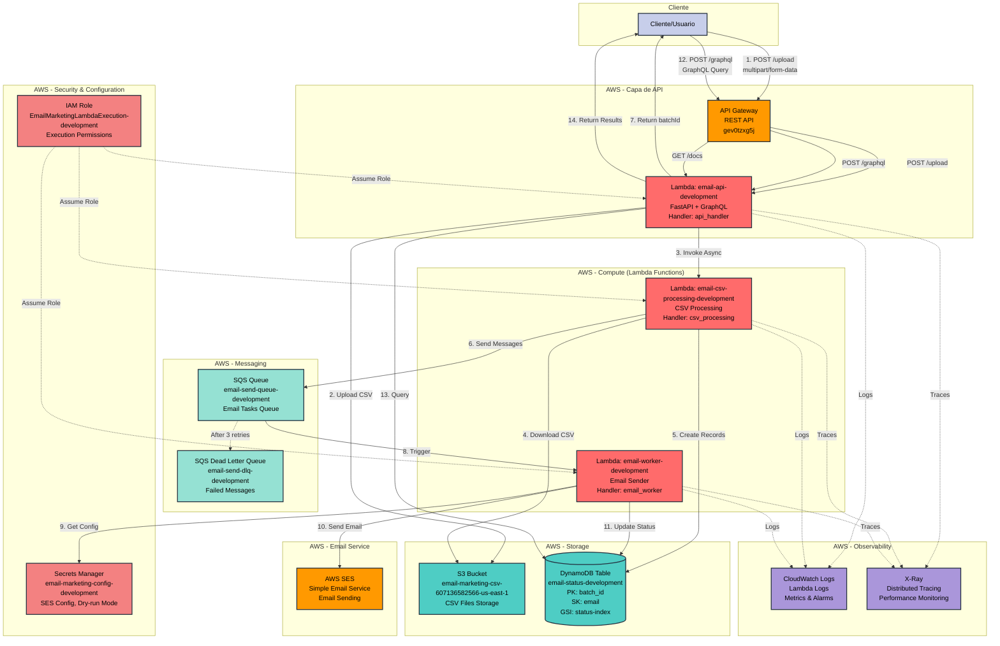
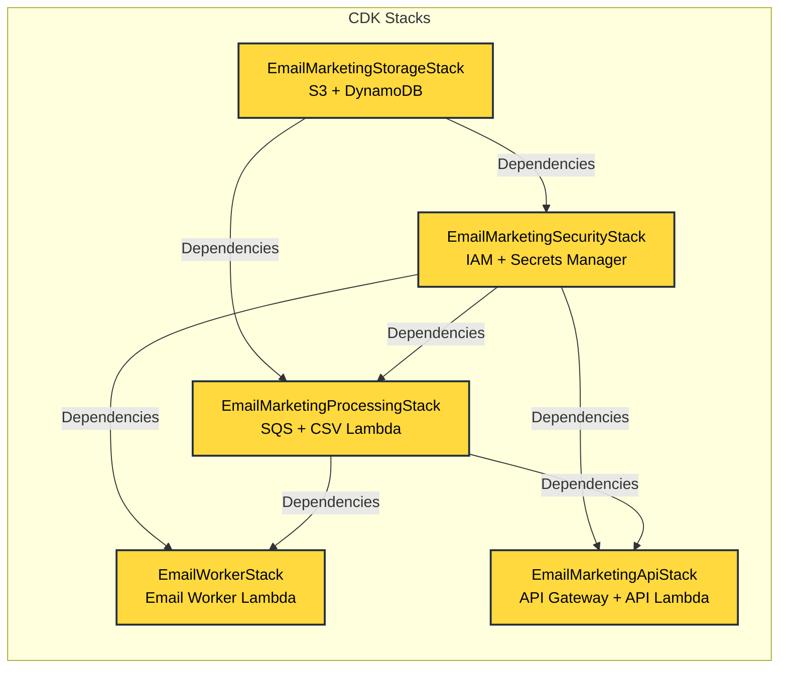
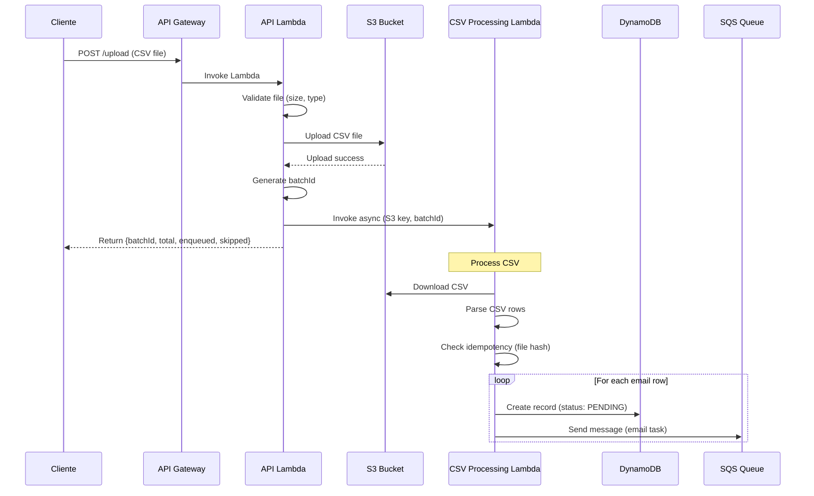
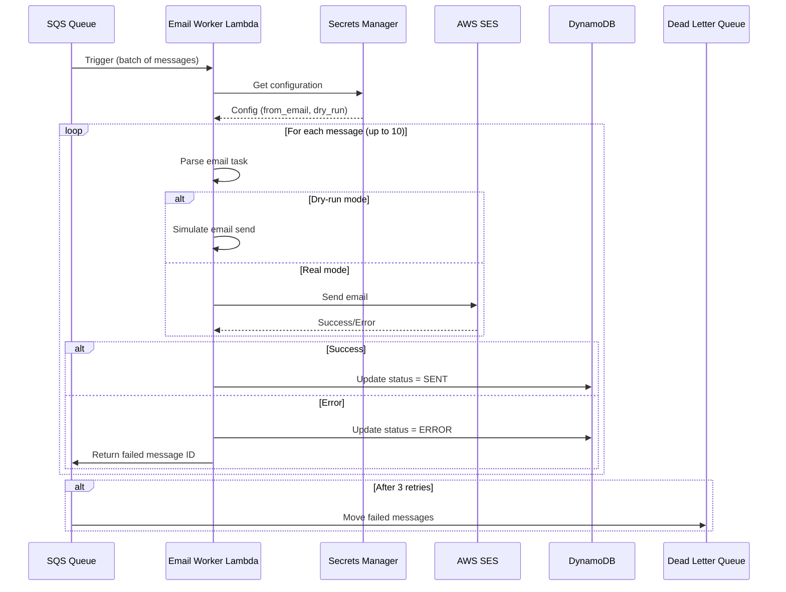
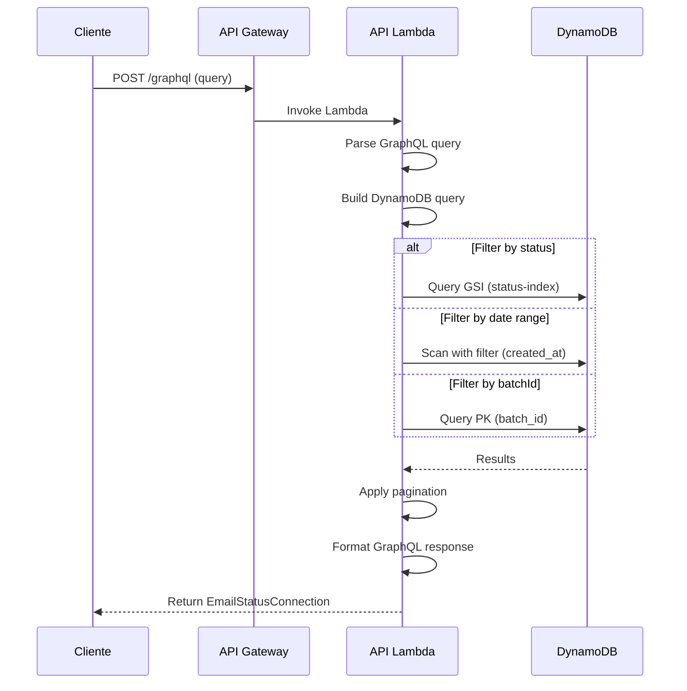

# Diagrama de Arquitectura AWS - Email Marketing Serverless

## Diagrama de Servicios AWS

## Diagrama de Stacks CDK

## Flujo de Datos Detallado

### 1. Flujo de Upload de CSV

### 2. Flujo de Envío de Emails

### 3. Flujo de Consulta GraphQL

## Componentes y Servicios AWS

### Servicios Utilizados

| Servicio | Propósito | Configuración |
|----------|-----------|---------------|
| **API Gateway** | REST API endpoint | Stage: v1, CORS habilitado |
| **Lambda** | Serverless compute | 3 funciones, Python 3.11 |
| **S3** | Almacenamiento de CSV | Bucket con versionado |
| **DynamoDB** | Base de datos de estados | On-demand, GSI para queries |
| **SQS** | Cola de mensajes | Queue + DLQ para errores |
| **SES** | Envío de emails | Configurado vía Secrets Manager |
| **Secrets Manager** | Configuración segura | Secret con SES config |
| **IAM** | Permisos y roles | Rol de ejecución para Lambdas |
| **CloudWatch** | Logs y métricas | Logs automáticos, métricas |
| **X-Ray** | Trazado distribuido | Habilitado en todas las Lambdas |

### Permisos IAM por Lambda

#### API Lambda
- `s3:PutObject`, `s3:GetObject` (bucket CSV)
- `dynamodb:Query`, `dynamodb:Scan` (tabla de estados)
- `lambda:InvokeFunction` (CSV processing Lambda)
- `secretsmanager:GetSecretValue` (config)

#### CSV Processing Lambda
- `s3:GetObject` (bucket CSV)
- `dynamodb:PutItem`, `dynamodb:GetItem` (tabla de estados)
- `sqs:SendMessage` (cola de emails)

#### Email Worker Lambda
- `dynamodb:UpdateItem`, `dynamodb:GetItem` (tabla de estados)
- `sqs:ReceiveMessage`, `sqs:DeleteMessage` (cola de emails)
- `ses:SendEmail` (envío de emails)
- `secretsmanager:GetSecretValue` (config)

## Endpoints Disponibles

- **API Base URL**: `https://gev0tzxg5j.execute-api.us-east-1.amazonaws.com/v1/`
- **Upload**: `POST /v1/upload`
- **GraphQL**: `POST /v1/graphql`
- **Documentación**: `GET /v1/docs`
- **OpenAPI Schema**: `GET /v1/openapi.json`

## Observabilidad

### CloudWatch Logs
- `/aws/lambda/email-api-development`
- `/aws/lambda/email-csv-processing-development`
- `/aws/lambda/email-worker-development`

### X-Ray Traces
- Trazado distribuido entre todos los servicios
- Identificación de cuellos de botella
- Análisis de latencia

### Métricas Clave
- Lambda invocations y errores
- SQS queue depth
- DynamoDB read/write units
- API Gateway request count y latency

