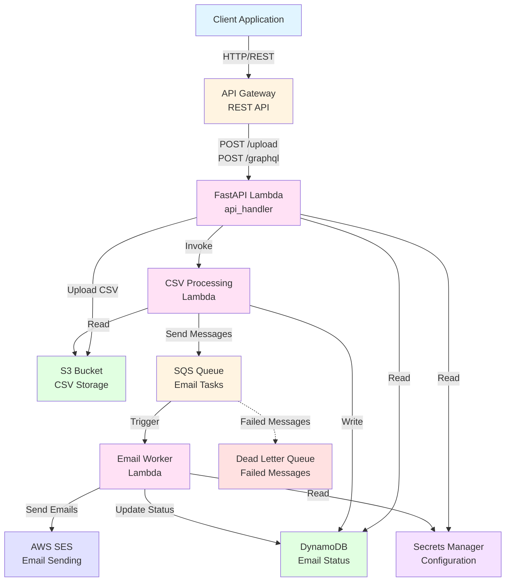

# Serverless Email Marketing System

A production-ready serverless email marketing system built with AWS CDK, FastAPI, and GraphQL. This system allows you to upload CSV files with email campaigns, process them asynchronously, send emails via AWS SES, and query email status through a GraphQL API.

## 🏗️ Architecture

### System Overview



### Core Components

1. **Storage Stack** (`EmailMarketingStorageStack`)
   - S3 bucket for CSV file uploads
   - DynamoDB table for email status tracking with GSI indexes

2. **Security Stack** (`EmailMarketingSecurityStack`)
   - IAM roles with least privilege permissions
   - Secrets Manager for configuration

3. **Processing Stack** (`EmailMarketingProcessingStack`)
   - SQS queue for email sending tasks
   - Dead Letter Queue (DLQ) for failed messages
   - Lambda function for CSV processing

4. **Worker Stack** (`EmailMarketingWorkerStack`)
   - Lambda function triggered by SQS
   - Sends emails via SES (or simulates in dry-run mode)

5. **API Stack** (`EmailMarketingApiStack`)
   - API Gateway REST API
   - FastAPI Lambda with GraphQL endpoint

### AWS Services Used

- **Amazon S3**: CSV file storage
- **Amazon DynamoDB**: Email status tracking
- **Amazon SQS**: Message queue for email tasks
- **AWS Lambda**: Serverless compute (FastAPI, CSV processing, email worker)
- **Amazon SES**: Email sending service
- **API Gateway**: REST API endpoint
- **AWS Secrets Manager**: Configuration management
- **AWS X-Ray**: Distributed tracing
- **CloudWatch**: Logging and metrics

## 📋 Features

### Functional Requirements

✅ **CSV Upload**
- Direct multipart/form-data upload
- Pre-signed URL upload option
- File size validation (100MB max)
- CSV structure validation

✅ **CSV Processing**
- Automatic parsing and validation
- Idempotency (prevents duplicate processing)
- Batch processing with error handling
- Status tracking in DynamoDB

✅ **Email Sending**
- Asynchronous processing via SQS
- SES integration (with dry-run mode)
- Error handling and retries
- DLQ for failed messages

✅ **GraphQL API**
- Query email status by:
  - Status (PENDING, SENT, ERROR)
  - Date range (from/to)
  - Batch ID
- Pagination support
- Real-time status updates

### Non-Functional Requirements

✅ **Idempotency**
- File hash-based duplicate detection
- Batch-level idempotency checks
- Email-level duplicate prevention

✅ **Error Handling**
- DLQ for failed messages
- Retry mechanism (max 3 attempts)
- Partial batch failure handling
- Comprehensive error logging

✅ **Security**
- IAM roles with least privilege
- Secrets Manager for sensitive data
- S3 bucket encryption
- API Gateway CORS configuration

✅ **Observability**
- CloudWatch Logs
- X-Ray tracing
- Custom metrics (via CloudWatch)
- Structured logging

✅ **Cost Optimization**
- Serverless architecture (pay-per-use)
- DynamoDB on-demand billing
- S3 lifecycle policies
- Reserved concurrency limits

## 🚀 Getting Started

### Prerequisites

- Python 3.11+
- AWS CLI configured
- AWS CDK CLI installed (`npm install -g aws-cdk`)
- AWS account with appropriate permissions

### Installation

1. **Clone the repository**
   ```bash
   cd prueba-omni
   ```

2. **Install Python dependencies**
   ```bash
   pip install -r requirements.txt
   ```

3. **Build Lambda Layer** (dependencies are now in a shared layer)
   ```bash
   .\scripts\build-layer.ps1  # Windows
   # or
   ./scripts/build-layer.sh   # Linux/Mac (if created)
   ```

4. **Bootstrap CDK** (first time only)
   ```bash
   cdk bootstrap
   ```

### Deployment

1. **Set environment variables**
   ```bash
   export CDK_DEFAULT_ACCOUNT=$(aws sts get-caller-identity --query Account --output text)
   export CDK_DEFAULT_REGION=us-east-1
   export ENVIRONMENT=development
   ```

2. **Deploy all stacks**
   ```bash
   python scripts/deploy.py deploy --environment development
   ```

   Or deploy individually:
   ```bash
   cdk deploy EmailMarketingStorageStack
   cdk deploy EmailMarketingSecurityStack
   cdk deploy EmailMarketingProcessingStack
   cdk deploy EmailMarketingWorkerStack
   cdk deploy EmailMarketingApiStack
   ```

3. **Get API endpoint**
   ```bash
   aws cloudformation describe-stacks \
     --stack-name EmailMarketingApiStack \
     --query 'Stacks[0].Outputs[?OutputKey==`ApiUrl`].OutputValue' \
     --output text
   ```

### Configuration

1. **Update Secrets Manager**
   ```bash
   aws secretsmanager put-secret-value \
     --secret-id email-marketing-config-development \
     --secret-string '{"ses_from_email": "your-email@example.com", "dry_run": "false"}'
   ```

2. **Verify SES email** (if not in production mode)
   ```bash
   aws ses verify-email-identity --email-address your-email@example.com
   ```

## 🔄 CI/CD con GitHub Actions

El proyecto incluye workflows de GitHub Actions para CI/CD automático.

### Workflows Disponibles

1. **`deploy.yml`** - Despliegue automático
   - Despliega a `development` cuando se hace push a `develop`
   - Despliega a `production` cuando se hace push a `main`
   - Soporta despliegue manual desde GitHub Actions

2. **`test.yml`** - Validación y tests
   - Ejecuta linting (black, isort, ruff, mypy)
   - Valida síntesis de CDK
   - Prueba construcción del Lambda Layer

### Configuración de Secrets

Configura los siguientes secrets en GitHub Settings → Secrets:

**Development:**
- `AWS_ACCESS_KEY_ID`
- `AWS_SECRET_ACCESS_KEY`
- `AWS_ACCOUNT_ID`

**Production:**
- `AWS_ACCESS_KEY_ID_PROD`
- `AWS_SECRET_ACCESS_KEY_PROD`
- `AWS_ACCOUNT_ID_PROD`

### Flujo de Trabajo

```
feature branch → PR → develop → main
                    ↓         ↓
              (tests)    (deploy dev)  (deploy prod)
```

Ver [`.github/workflows/README.md`](.github/workflows/README.md) para más detalles.

## 🛠️ Code Quality

El proyecto incluye herramientas de formateo automático:

### Instalación de Herramientas

```bash
pip install black isort ruff mypy
```

### Formateo Automático

```bash
# Formatear código
black .
isort .

# Linting
ruff check .

# Type checking
mypy . --ignore-missing-imports
```

### Pre-commit Hooks

Instala pre-commit hooks para formateo automático:

```bash
pip install pre-commit
pre-commit install
```

Los hooks se ejecutarán automáticamente antes de cada commit.

## 📖 API Documentation

### Endpoints

#### POST /upload

Upload a CSV file for processing.

**Request:**
```bash
curl -X POST https://<api-id>.execute-api.us-east-1.amazonaws.com/v1/upload \
  -F "file=@emails.csv" \
  -F "use_presigned_url=false"
```

**Response:**
```json
{
  "batchId": "550e8400-e29b-41d4-a716-446655440000",
  "message": "CSV file uploaded and processing started",
  "status": "processing"
}
```

#### POST /upload/presigned-url

Get a pre-signed URL for uploading CSV.

**Request:**
```bash
curl -X POST https://<api-id>.execute-api.us-east-1.amazonaws.com/v1/upload/presigned-url \
  -F "filename=emails.csv"
```

**Response:**
```json
{
  "batchId": "550e8400-e29b-41d4-a716-446655440000",
  "presignedUrl": "https://s3.amazonaws.com/...",
  "s3Key": "csv-uploads/.../emails.csv",
  "expiresIn": 3600
}
```

#### POST /graphql

Query email status using GraphQL.

**Request:**
```bash
curl -X POST https://<api-id>.execute-api.us-east-1.amazonaws.com/v1/graphql \
  -H "Content-Type: application/json" \
  -d '{
    "query": "query { listEmailStatus(status: [\"SENT\"], limit: 10) { items { batchId email status createdAt } total } }"
  }'
```

**Response:**
```json
{
  "data": {
    "listEmailStatus": {
      "items": [
        {
          "batchId": "550e8400-e29b-41d4-a716-446655440000",
          "email": "user@example.com",
          "status": "SENT",
          "createdAt": "2024-01-01T00:00:00"
        }
      ],
      "total": 1
    }
  }
}
```

### GraphQL Schema

```graphql
type Query {
  listEmailStatus(
    status: [String!]
    fromDate: String
    toDate: String
    batchId: String
    limit: Int
    nextToken: String
  ): EmailStatusConnection
}

type EmailStatus {
  batchId: String!
  email: String!
  subject: String!
  content: String!
  status: String!  # PENDING | SENT | ERROR
  createdAt: String!
  updatedAt: String!
  errorMessage: String
  sentAt: String
}

type EmailStatusConnection {
  items: [EmailStatus!]!
  nextToken: String
  total: Int!
}
```

### CSV Format

The CSV file must have the following columns:

```csv
email,subject,content
alice@example.com,Welcome,Alice welcome to our platform!
bob@example.com,Promo,Get 20% off this week.
```

**Constraints:**
- Maximum file size: 100MB
- Maximum rows: 100,000
- Required columns: `email`, `subject`, `content`
- Email format validation

## 🧪 Testing

### Quick Test (PowerShell)

1. **Upload CSV file**
   ```powershell
   .\upload.ps1
   ```
   This script automatically gets the API URL and uploads `emails.csv`.

2. **Check email status**
   ```powershell
   .\status.ps1 -BatchId "your-batch-id"
   ```
   Or query all emails:
   ```powershell
   .\status.ps1
   ```

### Quick Test (Bash)

1. **Upload CSV file**
   ```bash
   ./scripts/test_upload.sh
   ```

2. **Query GraphQL**
   ```bash
   ./scripts/test_graphql.sh [batch-id]
   ```

### Manual Testing with curl

1. **Get API URL**
   ```bash
   API_URL=$(aws cloudformation describe-stacks \
     --stack-name EmailMarketingApiStack \
     --query 'Stacks[0].Outputs[?OutputKey==`ApiUrl`].OutputValue' \
     --output text)
   ```

2. **Upload CSV**
   ```bash
   curl -X POST ${API_URL}upload \
     -F "file=@emails.csv"
   ```

3. **Query by batch ID**
   ```bash
   curl -X POST ${API_URL}graphql \
     -H "Content-Type: application/json" \
     -d '{
       "query": "query { listEmailStatus(batchId: \"your-batch-id\", limit: 10) { items { batchId email status subject createdAt } total } }"
     }'
   ```

4. **Query by status**
   ```bash
   curl -X POST ${API_URL}graphql \
     -H "Content-Type: application/json" \
     -d '{
       "query": "query { listEmailStatus(status: [\"SENT\"], limit: 10) { items { batchId email status sentAt } total } }"
     }'
   ```

5. **Query by date range**
   ```bash
   curl -X POST ${API_URL}graphql \
     -H "Content-Type: application/json" \
     -d '{
       "query": "query { listEmailStatus(fromDate: \"2024-01-01T00:00:00\", toDate: \"2024-01-31T23:59:59\", limit: 10) { items { batchId email status createdAt } total } }"
     }'
   ```

### Postman Collection

Import `postman_collection.json` into Postman or Insomnia for easy testing.

## 📊 Monitoring

### CloudWatch Metrics

- Lambda invocations and errors
- SQS queue depth
- DynamoDB read/write capacity
- API Gateway request count and latency

### X-Ray Tracing

Enable X-Ray tracing to see distributed traces across:
- API Gateway → Lambda
- Lambda → S3
- Lambda → DynamoDB
- Lambda → SQS
- Lambda → SES

### Logs

All Lambda functions log to CloudWatch Logs:
- `/aws/lambda/email-api-{environment}`
- `/aws/lambda/email-csv-processing-{environment}`
- `/aws/lambda/email-worker-{environment}`

## 💰 Cost Estimation

**Monthly costs (approximate, low traffic):**

- **Lambda**: ~$5-10 (1M requests)
- **DynamoDB**: ~$1-5 (on-demand)
- **S3**: ~$0.50-2 (storage + requests)
- **SQS**: ~$0.40 (1M requests)
- **API Gateway**: ~$3.50 (1M requests)
- **SES**: ~$0.10 (1000 emails)
- **CloudWatch**: ~$1-3 (logs + metrics)
- **X-Ray**: ~$0.50 (traces)

**Total**: ~$12-25/month (low traffic)

**Cost optimization tips:**
- Use DynamoDB on-demand billing
- Enable S3 lifecycle policies
- Set reserved concurrency limits
- Use CloudWatch Logs retention policies

## 🔒 Security

### IAM Roles

All Lambda functions use IAM roles with least privilege:
- S3: Read/write access to CSV bucket only
- DynamoDB: Read/write access to status table only
- SQS: Send/receive messages to email queue only
- SES: Send email permissions
- Secrets Manager: Read access to config secret only

### Secrets Management

Sensitive configuration stored in AWS Secrets Manager:
- SES from email address
- Dry-run mode flag

### Encryption

- S3: Server-side encryption (S3-managed keys)
- DynamoDB: Encryption at rest (AWS-managed keys)
- SQS: Server-side encryption (SQS-managed keys)

## 🛠️ Development

### Project Structure

```
prueba-omni/
├── app.py                          # CDK app entry point
├── cdk.json                        # CDK configuration
├── requirements.txt                # Python dependencies
├── pyproject.toml                  # Code quality config (black, isort, ruff, mypy)
├── .pre-commit-config.yaml         # Pre-commit hooks
├── README.md                       # This file
├── upload.ps1                      # Script: Upload CSV
├── status.ps1                      # Script: Query status
├── .github/
│   └── workflows/                  # GitHub Actions CI/CD
│       ├── deploy.yml              # Deployment workflow
│       ├── test.yml                # Test and validation workflow
│       └── README.md               # CI/CD documentation
├── infrastructure/
│   ├── core/                       # Infrastructure stacks
│   │   ├── storage_stack.py        # S3 + DynamoDB
│   │   ├── security_stack.py       # IAM + Secrets
│   │   ├── layer_stack.py          # Lambda Layer
│   │   ├── processing_stack.py     # SQS + CSV processing
│   │   ├── worker_stack.py         # Email worker
│   │   └── api_stack.py            # API Gateway + FastAPI
│   ├── functions/                   # Lambda functions
│   │   ├── api/                    # API Lambda (solo código)
│   │   │   ├── api_handler.py      # FastAPI handler
│   │   │   └── graphql_schema.py   # GraphQL schema
│   │   ├── csv/                    # CSV Processing Lambda
│   │   │   └── csv_processing.py   # CSV processing handler
│   │   ├── worker/                 # Email Worker Lambda
│   │   │   └── email_worker.py     # Email sending handler
│   │   └── layer/                  # Lambda Layer (dependencias)
│   │       ├── requirements.txt    # Dependencies
│   │       └── python/lib/python3.11/site-packages/
│   └── shared/
│       └── constants.py             # Shared constants
├── scripts/                        # Deployment scripts
│   ├── build-layer.ps1             # Build Lambda Layer
│   ├── deploy.py                   # CDK deployment
│   ├── destroy-all.ps1             # Destroy all stacks
│   └── ...
└── examples/
    └── sample_emails.csv            # Example CSV
└── scripts/
    └── deploy.py                   # Deployment script
```

### Local Development

1. **Install dependencies**
   ```bash
   pip install -r requirements.txt
   pip install -r infrastructure/functions/requirements.txt
   ```

2. **Run tests** (if available)
   ```bash
   pytest
   ```

3. **Format code**
   ```bash
   black .
   isort .
   ```

### Environment Variables

- `ENVIRONMENT`: Environment name (development, staging, production)
- `CDK_DEFAULT_ACCOUNT`: AWS account ID
- `CDK_DEFAULT_REGION`: AWS region

## 🐛 Troubleshooting

### Common Issues

1. **CSV processing fails**
   - Check CloudWatch Logs for CSV processing Lambda
   - Verify CSV format matches requirements
   - Check S3 bucket permissions

2. **Emails not sending**
   - Verify SES configuration in Secrets Manager
   - Check if SES is in sandbox mode (verify email addresses)
   - Review email worker Lambda logs

3. **GraphQL queries return empty**
   - Verify DynamoDB table has data
   - Check GSI indexes are created
   - Review API Lambda logs

4. **API Gateway returns 500**
   - Check API Lambda logs
   - Verify environment variables
   - Check IAM permissions

## 📝 License

This project is provided as-is for demonstration purposes.

## 🤝 Contributing

This is a technical challenge project. For production use, consider:
- Adding unit tests
- Implementing CI/CD pipeline
- Adding more comprehensive error handling
- Implementing rate limiting
- Adding API authentication
- Implementing multi-region deployment

## 📚 Additional Resources

- [AWS CDK Documentation](https://docs.aws.amazon.com/cdk/)
- [FastAPI Documentation](https://fastapi.tiangolo.com/)
- [Strawberry GraphQL](https://strawberry.rocks/)
- [AWS SES Documentation](https://docs.aws.amazon.com/ses/)
- [DynamoDB Best Practices](https://docs.aws.amazon.com/amazondynamodb/latest/developerguide/best-practices.html)

